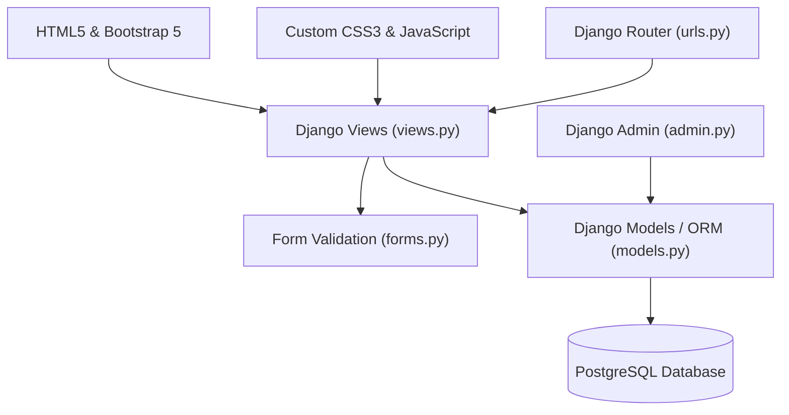
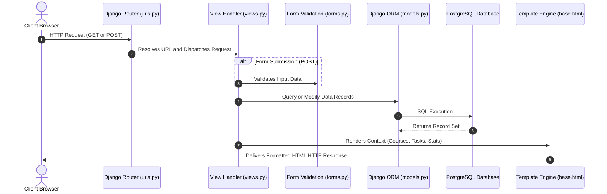

# 🎓 Course Tracker & Task Manager

[](https://www.djangoproject.com/)
[](https://www.python.org/)
[](https://www.postgresql.org/)
[](https://getbootstrap.com/)
[](LICENSE)

> A modern, full-stack Django web application designed to track learning progress, manage educational courses, and organize task workflows with an intuitive dashboard and rich visual analytics.

---

## 📌 Table of Contents
- [Architecture Overview](#-architecture-overview)
- [Django Request-Response Cycle](#-django-request-response-cycle)
- [Key Features](#-key-features)
- [Tech Stack](#-tech-stack)
- [Project Directory Structure](#-project-directory-structure)
- [Database Schema](#-database-schema)
- [Installation & Setup](#-installation--setup)
- [Running the Application](#-running-the-application)
- [License](#-license)

---

## 🏗️ Architecture Overview

The system follows a clean modular architecture separating the **Frontend presentation layer**, the **Backend Django MVC engine**, and the persistent **PostgreSQL Database**.


### System Flow Diagram



---

## 🔄 Django Request-Response Cycle

Understanding how requests flow through the application from the client's browser to the database and back:



---

## ✨ Key Features

- 📊 **Real-Time Analytics Dashboard**: Tracks total courses, active enrolments, completed milestones, and calculated overall progress percentage.
- 📚 **Comprehensive Course Management**: Full CRUD operations (Create, View, Edit, Delete) for managing course details, instructors, categories, and progress status.
- 📋 **Integrated Task Tracking**: Create course-specific tasks with due dates, descriptions, and completion badges.
- 🎨 **Modern Responsive UI/UX**:
  - Dark slate glassmorphism header with logo branding.
  - Interactive status badges (`Not Started`, `In Progress`, `Completed`).
  - Animated progress bars and responsive data tables.
- 🛡️ **Data Validation & Integrity**: Automatic form validation preventing invalid progress percentages or inverted start/end dates.

---

## 🛠️ Tech Stack

| Component | Technology | Description |
| :--- | :--- | :--- |
| **Backend** | Python 3.10+, Django 5+ | Robust Web Framework & ORM |
| **Database** | PostgreSQL | Enterprise relational database storage |
| **Frontend** | HTML5, Vanilla CSS3, JavaScript | Responsive client interfaces |
| **UI Framework**| Bootstrap 5.3, Bootstrap Icons | Modern grid system, icons & UI components |
| **Styling** | Custom CSS (Inter Font) | Custom glassmorphism navbar & card hover animations |

---

## 📁 Project Directory Structure

```text
Todo APP using Django/
├── manage.py                   # Django CLI utility script
├── requirements.txt            # Python dependencies specification
├── project arch.jpg            # System architecture diagram
├── todo_project/               # Core project configuration
│   ├── __init__.py
│   ├── asgi.py
│   ├── settings.py             # App settings, DB config & static paths
│   ├── urls.py                 # Root URL router
│   └── wsgi.py
├── courses/                    # Main application app
│   ├── admin.py                # Django Admin registration
│   ├── apps.py
│   ├── forms.py                # ModelForm definitions (CourseForm, TaskForm)
│   ├── models.py               # Database schemas (Course, Task)
│   ├── urls.py                 # App-level routing rules
│   ├── views.py                # Business logic & view controllers
│   ├── images/
│   │   └── logo.jpg            # Website logo branding asset
│   ├── static/courses/
│   │   ├── css/style.css       # Custom stylesheet & theme definitions
│   │   └── js/app.js           # Client-side scripts
│   └── templates/courses/
│       ├── base.html           # Master layout template
│       ├── dashboard.html      # Analytics dashboard view
│       ├── course_list.html    # All courses table view
│       ├── course_detail.html  # Single course details & tasks view
│       ├── course_form.html    # Create/Edit course view
│       ├── task_form.html      # Create task view
│       └── course_confirm_delete.html # Confirmation modal
└── venv/                       # Virtual environment directory
```

---

## 📊 Database Schema

### `Course` Model
| Field | Type | Attributes | Description |
| :--- | :--- | :--- | :--- |
| `id` | `BigAutoField` | Primary Key, Auto | Unique ID |
| `title` | `CharField` | `max_length=200` | Title of the course |
| `description` | `TextField` | `blank=True` | Detailed course summary |
| `instructor` | `CharField` | `max_length=100` | Instructor name |
| `category` | `CharField` | `max_length=100` | Subject category |
| `start_date` | `DateField` | `null=True, blank=True` | Start date |
| `end_date` | `DateField` | `null=True, blank=True` | Expected completion date |
| `progress` | `PositiveIntegerField` | `default=0` | Percentage (0-100) |
| `status` | `CharField` | Choices: `not_started`, `in_progress`, `completed` | Course status |

### `Task` Model
| Field | Type | Attributes | Description |
| :--- | :--- | :--- | :--- |
| `id` | `BigAutoField` | Primary Key, Auto | Unique ID |
| `course` | `ForeignKey` | `CASCADE, related_name="tasks"` | Associated Course |
| `title` | `CharField` | `max_length=200` | Task title |
| `description` | `TextField` | `blank=True` | Task details |
| `due_date` | `DateField` | `null=True, blank=True` | Due date |
| `completed` | `BooleanField` | `default=False` | Completion state |

---

## ⚡ Installation & Setup

### Prerequisites
- **Python 3.10+** installed on your system.
- **PostgreSQL 14+** service running locally or remotely.

### 1. Clone Repository & Navigate
```bash
git clone https://github.com/foysalpranto121/TODO_using-Django.git
cd "TODO_using-Django"
```

### 2. Set Up Virtual Environment
```bash
# Windows
python -m venv venv
.\venv\Scripts\activate

# macOS / Linux
python3 -m venv venv
source venv/bin/activate
```

### 3. Install Dependencies
```bash
pip install -r requirements.txt
```

### 4. Database Configuration
Configure your PostgreSQL parameters in `todo_project/settings.py`:
```python
DATABASES = {
    'default': {
        'ENGINE': 'django.db.backends.postgresql',
        'NAME': 'todo_db',
        'USER': 'postgres',
        'PASSWORD': 'your_password',
        'HOST': 'localhost',
        'PORT': '5432',
    }
}
```

### 5. Run Database Migrations
```bash
python manage.py makemigrations
python manage.py migrate
```

### 6. Create Superuser (Admin Access)
```bash
python manage.py createsuperuser
```

---

## 🚀 Running the Application

Start the local Django development server:
```bash
python manage.py runserver
```

Open your browser and navigate to:
- **Application Dashboard:** `http://127.0.0.1:8000/`
- **Django Admin Portal:** `http://127.0.0.1:8000/admin/`

---

## 🌐 cPanel Shared Hosting Deployment (`prantodev.com`)

To host this Django project on your **Shared Hosting SSD NVMe (`prantodev.com`)** via cPanel:

1. **Log in to cPanel:** Click `Log in to cPanel` from your hosting client portal.
2. **Setup Python Application:**
   - In cPanel, search for **"Setup Python App"** under Software.
   - Click **Create Application**.
   - Select **Python Version** (e.g., `3.10` or `3.11`).
   - Set **Application Root**: `TODO_using-Django` (or root path where files are uploaded).
   - Set **Application URL**: `prantodev.com` (or `todo.prantodev.com`).
   - Set **Application Startup File**: `passenger_wsgi.py`.
   - Set **Application Entry Point**: `application`.
3. **Upload / Git Clone Repository:**
   - Upload project files or clone via cPanel Git Version Control into the app root folder.
4. **Install Dependencies:**
   - Inside cPanel **Setup Python App**, click **Run pip install** and specify `requirements.txt` (or run in cPanel Terminal).
5. **Database Configuration:**
   - Go to **PostgreSQL Databases** (or **MySQL Databases**) in cPanel and create a database + user.
   - Update `DATABASES` settings in `todo_project/settings.py` with database name, user, and password.
6. **Migrate & Collect Static Files:**
   - Run in cPanel Terminal (or Virtualenv):
     ```bash
     python manage.py migrate
     python manage.py collectstatic
     ```
7. **Restart Application:** Click **Restart** inside cPanel Setup Python App!

---

## 📜 License

Distributed under the **MIT License**. See `LICENSE` for more information.

Developed with ❤️ using **Django** and **PostgreSQL**.

