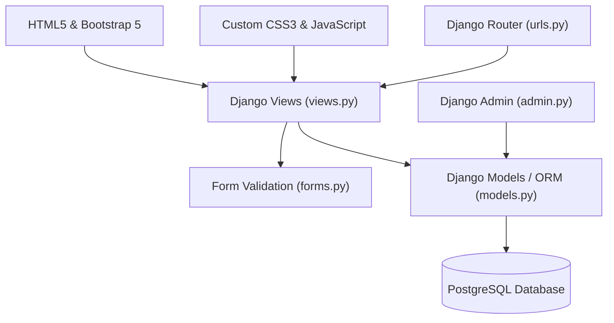
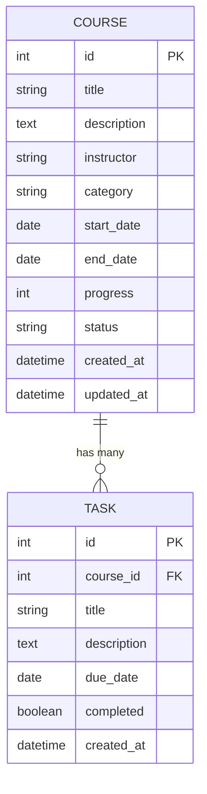

# 📖 Complete Technical Deep-Dive & Architecture Explanation

Welcome to the comprehensive technical documentation for the **Course Tracker & Task Manager** Django application. This document provides a deep, line-by-line architectural breakdown of how the application functions—from database design and ORM mechanics to form validation lifecycles, view controllers, URL dispatching, and template rendering.

---

## 📌 Table of Contents
1. [Architectural Pattern: Django MVT](#1-architectural-pattern-django-mvt)
2. [Database Schema & ORM Deep-Dive](#2-database-schema--orm-deep-dive)
3. [Form Lifecycle & Complex Validation](#3-form-lifecycle--complex-validation)
4. [View Controllers & Business Logic](#4-view-controllers--business-logic)
5. [URL Dispatcher & Reverse Resolution](#5-url-dispatcher--reverse-resolution)
6. [Template Engine & Styling System](#6-template-engine--styling-system)
7. [Summary of Advanced Concepts](#7-summary-of-advanced-concepts)

---

## 1. 🏛️ Architectural Pattern: Django MVT

Django uses the **MVT (Model-View-Template)** architectural pattern, which is a variation of the traditional **MVC (Model-View-Controller)** pattern.




| Layer | Responsibility in this Application |
| :--- | :--- |
| **Model (`courses/models.py`)** | Defines the data structure (`Course` & `Task`), handles database schema creation, table relationships, and ORM operations. |
| **View (`courses/views.py`)** | Implements the business logic, handles GET/POST requests, invokes form validation, queries the database via ORM, and selects templates to render. |
| **Template (`courses/templates/`)** | Presents the data to the user using HTML5, Bootstrap 5, custom CSS, and Django Template Language (DTL). |

---

## 2. 🗄️ Database Schema & ORM Deep-Dive

Located in `courses/models.py`, the data model contains two primary entities: **`Course`** and **`Task`**.



### A. The `Course` Model
```python
class Course(models.Model):
    STATUS_CHOICES = [
        ("not_started", "Not Started"),
        ("in_progress", "In Progress"),
        ("completed", "Completed"),
    ]

    title = models.CharField(max_length=200)
    description = models.TextField(blank=True)
    instructor = models.CharField(max_length=100, blank=True)
    category = models.CharField(max_length=100, blank=True)

    start_date = models.DateField(null=True, blank=True)
    end_date = models.DateField(null=True, blank=True)

    progress = models.PositiveIntegerField(default=0)

    status = models.CharField(
        max_length=20,
        choices=STATUS_CHOICES,
        default="not_started"
    )

    created_at = models.DateTimeField(auto_now_add=True)
    updated_at = models.DateTimeField(auto_now=True)

    class Meta:
        ordering = ["-created_at"]

    def __str__(self):
        return self.title
```

#### Key Technical Concepts in `Course`:
1. **Choice Tuples (`STATUS_CHOICES`):**
   - The first element in each tuple (`"not_started"`) is stored in the database.
   - The second element (`"Not Started"`) is the human-readable label displayed in forms and admin portals.
   - In Django templates, calling `{{ course.get_status_display }}` automatically resolves the human-readable string without writing `if/else` logic.
2. **Date Audit Fields:**
   - `auto_now_add=True`: Timestamp recorded **only once** when the object is created.
   - `auto_now=True`: Timestamp updated **automatically every time** `course.save()` is executed.
3. **Meta Ordering (`ordering = ["-created_at"]`):**
   - The `-` prefix specifies descending order. Whenever `Course.objects.all()` is executed, Django automatically appends `ORDER BY created_at DESC` to the SQL query.

---

### B. The `Task` Model & Foreign Key Relationship
```python
class Task(models.Model):
    course = models.ForeignKey(
        Course,
        on_delete=models.CASCADE,
        related_name="tasks"
    )

    title = models.CharField(max_length=200)
    description = models.TextField(blank=True)
    due_date = models.DateField(null=True, blank=True)
    completed = models.BooleanField(default=False)
    created_at = models.DateTimeField(auto_now_add=True)

    class Meta:
        ordering = ["due_date", "-created_at"]

    def __str__(self):
        return self.title
```

#### Complex Relational Concepts in `Task`:
1. **Cascading Deletion (`on_delete=models.CASCADE`):**
   - Establishes a **One-to-Many** relationship (One Course has Many Tasks).
   - If a `Course` record is deleted, Django and the SQL engine automatically delete all child `Task` records associated with that course to maintain referential integrity.
2. **Reverse Relationship (`related_name="tasks"`):**
   - By default, Django creates a reverse accessor named `task_set`.
   - By specifying `related_name="tasks"`, we can access a course's tasks directly on the instance:
     ```python
     # Inside Python/Views:
     course_tasks = course.tasks.all()
     
     # Inside Django Templates:
     
     ```
   - This eliminates the need for manual filtering queries like `Task.objects.filter(course=course)`.

---

## 3. 📝 Form Lifecycle & Complex Validation

Located in `courses/forms.py`, Django `ModelForm` classes bridge HTML form inputs with Django models.

```
📥 HTTP POST Request ──► Form Instantiation ──► form.is_valid()
                                                    │
             ┌──────────────────────────────────────┴──────────────────────────────────────┐
             ▼                                                                             ▼
   1. Field Type Checks                                                          2. clean_<fieldname>()
 (e.g. integer, required)                                                      (clean_progress: 0 <= val <= 100)
             │                                                                             │
             └──────────────────────────────────────┬──────────────────────────────────────┘
                                                    ▼
                                          3. ModelForm.clean()
                                  (Cross-field validation: end_date >= start_date)
                                                    │
                                   ┌────────────────┴────────────────┐
                                   ▼                                 ▼
                             ✅ PASS                           ❌ FAIL
                       cleaned_data populated                   form.errors populated
```

### A. Field-Level Validation (`clean_progress`)
```python
def clean_progress(self):
    progress = self.cleaned_data["progress"]

    if progress < 0 or progress > 100:
        raise forms.ValidationError(
            "Progress must be between 0 and 100."
        )

    return progress
```
- Django automatically invokes any method named `clean_<fieldname>()` during `form.is_valid()`.
- `self.cleaned_data` contains sanitized, type-converted data.
- Returning `progress` assigns the validated value back to `cleaned_data`.

### B. Cross-Field Validation (`clean()`)
```python
def clean(self):
    cleaned_data = super().clean()

    start_date = cleaned_data.get("start_date")
    end_date = cleaned_data.get("end_date")

    if start_date and end_date and end_date < start_date:
        raise forms.ValidationError(
            "End date cannot be earlier than start date."
        )

    return cleaned_data
```
- `clean()` is called **after** individual field validations complete.
- This allows accessing multiple fields simultaneously (`start_date` and `end_date`) to enforce cross-field business logic.

---

## 4. 🧠 View Controllers & Business Logic

Located in `courses/views.py`, views contain the core request-handling algorithms.

### A. The `dashboard` View & Database Aggregation
```python
from django.db.models import Avg

def dashboard(request):
    courses = Course.objects.all().order_by("-created_at")[:5]
    total_courses = Course.objects.count()
    active_courses = Course.objects.exclude(status="completed").count()
    completed_courses = Course.objects.filter(status="completed").count()

    avg_progress = Course.objects.aggregate(avg=Avg("progress"))["avg"]
    overall_progress = int(round(avg_progress)) if avg_progress is not None else 0

    context = {
        "courses": courses,
        "total_courses": total_courses,
        "active_courses": active_courses,
        "completed_courses": completed_courses,
        "overall_progress": overall_progress,
    }
    return render(request, "courses/dashboard.html", context)
```

#### Technical Deep Dive:
1. **QuerySet Slicing (`[:5]`):** Translates to SQL `LIMIT 5`. This prevents loading unnecessary database records when only recent courses are needed.
2. **SQL Aggregation (`Avg("progress")`):**
   - Instead of fetching all course objects into Python memory and summing them (which is slow $O(N)$), Django pushes the math operation to PostgreSQL:
     ```sql
     SELECT AVG("courses_course"."progress") FROM "courses_course";
     ```
   - This executes in $O(1)$ database memory time.

---

### B. The `task_create` View & Partial Save (`commit=False`)
```python
def task_create(request, course_pk):
    course = get_object_or_404(Course, pk=course_pk)

    if request.method == "POST":
        form = TaskForm(request.POST)
        if form.is_valid():
            task = form.save(commit=False)
            task.course = course
            task.save()
            return redirect("courses:course_detail", pk=course.pk)
    else:
        form = TaskForm()

    return render(
        request,
        "courses/task_form.html",
        {"form": form, "course": course}
    )
```

#### Why `commit=False` is Critical:
- `TaskForm` excludes the `course` field so the user doesn't have to select a course dropdown manually.
- Calling `form.save(commit=False)` creates the `Task` model instance **in memory without sending a `INSERT INTO` SQL command to PostgreSQL**.
- This allows us to inject `task.course = course` before explicitly calling `task.save()`.
- **PRG Pattern (Post/Redirect/Get):** Returning `redirect(...)` issues a `302 Found` HTTP redirect to the browser, preventing accidental duplicate form submissions if the user refreshes the browser.

---

## 5. 🔀 URL Dispatcher & Reverse Resolution

Located in `courses/urls.py` and `todo_project/urls.py`.

### A. URL Configuration
```python
# courses/urls.py
app_name = "courses"

urlpatterns = [
    path("", views.dashboard, name="dashboard"),
    path("courses/", views.course_list, name="course_list"),
    path("courses/<int:pk>/", views.course_detail, name="course_detail"),
    path("courses/<int:course_pk>/tasks/create/", views.task_create, name="task_create"),
]
```

### B. App Namespacing & URL Reversing
- `app_name = "courses"` establishes a namespace.
- In templates or views, referencing `"courses:course_detail"` resolves dynamically:
  ```html
  <!-- HTML Template -->
  <a href="">View</a>
  ```
- If the URL pattern changes from `/courses/5/` to `/all-courses/5/`, no template code breaks because Django resolves the route dynamically by name!

---

## 6. 🖼️ Template Engine & Styling System

### A. Template Inheritance (`base.html`)
The application uses a master layout in `courses/templates/courses/base.html`.

```html
<!-- base.html snippet -->
<body class="d-flex flex-column min-vh-100 bg-light">

    <nav class="navbar navbar-expand-lg custom-navbar sticky-top py-2.5 shadow-sm">
        <div class="container">
            <a class="navbar-brand d-flex align-items-center gap-2.5" href="">
                
                <span class="brand-title ms-1">Course Tracker</span>
            </a>
            ...
        </div>
    </nav>

    <main class="container py-4 flex-grow-1">
        
        
    </main>

</body>
```

Sub-templates extend `base.html`:
```html


Dashboard | Course Tracker


    <!-- Dashboard HTML content inserted here -->

```

---

## 7. 💡 Summary of Advanced Concepts

1. **OR-Mapping (ORM):** Converts Python class attributes into PostgreSQL SQL queries safely, protecting against SQL injection attacks.
2. **Referential Integrity:** Cascading foreign key constraints guarantee child tasks are purged when a parent course is removed.
3. **Optimized Aggregation:** Pushing calculation logic (`Avg("progress")`) down to PostgreSQL database engine.
4. **Form Validation Pipeline:** Multi-tier validation (`clean_progress` for field bounds, `clean()` for cross-field date logic).
5. **PRG Security Pattern:** Prevents form resubmissions via HTTP 302 redirects after successful POST actions.

---

*Documentation generated for Course Tracker Application.*
